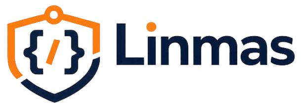

<div align="center">
  

  <h1>Linmas</h1>

  <p><strong>First-line defensive security skills for Claude Code and compatible AI coding agents.</strong></p>

  <p>
    Practical, reviewable, and safety-bounded security guidance for builders, vibe coders, and teams shipping software with AI assistance.
  </p>

  <p>
    <a href="LICENSE"></a>
    <a href="https://www.npmjs.com/package/linmas"></a>
    <a href="https://www.npmjs.com/package/linmas"></a>
    
    
  </p>

  <p>
    
    
    
    
  </p>
</div>

---

## What is Linmas?

Linmas is an open-source defensive security skill collection for Claude Code and compatible AI coding agents.

Linmas is an open-source security assistant inspired by Indonesia’s community protection concept, Perlindungan Masyarakat. It is not affiliated with any government institution.

It provides reusable security-specialist instructions under `skills/<skill-name>/SKILL.md`, so AI coding agents can help with practical security review, secure architecture, cloud hardening, incident triage, detection engineering, compliance review, and authorized validation work.

Linmas is designed to be:

- **Practical** — focused on concrete checks, remediation guidance, and reviewable outputs.
- **Defensive** — scoped for authorized security work only.
- **Reusable** — packaged as installable skills that can be shared across projects.
- **Beginner-friendly** — useful for builders who may not yet know what security controls to ask for.
- **Reviewable** — structured so humans can inspect, validate, and reject unsafe or incorrect recommendations.

## Why the name “Linmas”?

**Linmas** stands for **Perlindungan Masyarakat**, an Indonesian community-protection organization formed at the village or urban-neighborhood level to help maintain public safety, order, and community resilience.

Previously known as **Pertahanan Sipil** or **Hansip**, Linmas members often act as a first layer of protection in public activities, disaster response, elections, and local community safety.

This project uses the name Linmas because security should not only be accessible after a team becomes mature enough to hire dedicated security specialists. Many beginner builders and vibe coders ship code before they fully understand authentication risks, authorization flaws, secret exposure, insecure file upload, cloud misconfiguration, logging gaps, dependency risk, or incident response basics.

Linmas is not meant to be the “police”, “military”, or final authority of application security. It is meant to be the **first layer of defense closest to everyday builders**: a practical guardrail that helps people notice risks earlier, ask better security questions, and improve their code before problems reach production.

## Who Linmas is for

Linmas is intended for:

- solo developers and indie hackers building with AI coding agents;
- vibe coders who need security guidance without becoming security specialists first;
- engineering teams that want reusable defensive security prompts and checklists;
- maintainers who want safer review workflows for open-source projects;
- teams preparing for secure architecture review, cloud hardening, detection engineering, incident triage, or compliance readiness.

## What Linmas includes

The current public package includes:

```text
skills/       Security skill definitions
scripts/      Validation and package helper scripts
README.md     Project documentation
package.json  npm package metadata and commands
LICENSE       Apache-2.0 license text
NOTICE        Attribution guidance
TRADEMARK.md  Name and branding restrictions
```

Installable skills are first-class entries under:

```text
skills/<skill-name>/SKILL.md
```

## Skill catalog

| Skill | Primary use | Typical output |
|---|---|---|
| `secure-code-reviewer` | Secure code review, threat modeling, remediation guidance | Vulnerability findings, impact, fixes, review notes |
| `smart-contract-reviewer` | Authorized Web3, smart contract, and protocol risk review | Contract risk notes, exploitability assessment, safer patterns |
| `cloud-hardening-architect` | Cloud IAM, segmentation, hardening, platform guardrails | Hardening plan, IAM review, control placement |
| `controls-compliance-reviewer` | Control mapping, evidence review, audit readiness | Control gaps, evidence checklist, audit notes |
| `incident-triage-lead` | Incident triage, containment planning, response coordination | Triage plan, containment steps, evidence handling |
| `exploit-validation-specialist` | Authorized exploit-path validation and proof-of-impact review | Bounded validation plan, proof notes, remediation priority |
| `secure-systems-architect` | Trust-boundary analysis and secure system design | Architecture risks, control map, safer design options |
| `security-domain-router` | Selecting the right Linmas specialist for a task | Recommended skill routing and scope clarification |
| `security-operations-lead` | Monitoring workflows, operational hardening, escalation readiness | Runbooks, alert workflow, operational gaps |
| `detection-rules-engineer` | SIEM rules, telemetry mapping, alert tuning | Detection logic, rule tuning, telemetry requirements |
| `threat-research-analyst` | IOC analysis, adversary tracking, defensive intelligence | Threat summary, IOC notes, defensive recommendations |

## Installation

Use `npx` to inspect and install Linmas skills:

```bash
npx linmas list
npx linmas detect
npx linmas install secure-code-reviewer --dry-run
```

Install a specific skill:

```bash
npx linmas install secure-code-reviewer
```

Install all first-class Linmas skills:

```bash
npx linmas install --all
```

Inspect the host and managed-install health:

```bash
npx linmas doctor
```

Remove a Linmas-managed skill:

```bash
npx linmas uninstall secure-code-reviewer
```

## CLI command reference

| Command | Purpose |
|---|---|
| `npx linmas list` | List available Linmas skills |
| `npx linmas detect` | Detect compatible AI coding-agent hosts |
| `npx linmas install <skill>` | Install one skill to a detected host |
| `npx linmas install --all` | Install all first-class Linmas skills |
| `npx linmas onboard` | Explain what the skills are for and where they are installed |
| `npx linmas doctor` | Inspect host detection and managed-install health |
| `npx linmas uninstall <skill>` | Remove one Linmas-managed skill |

## Suggested workflow

```text
1. Detect the host environment
2. Choose the security domain or ask the router skill
3. Install the relevant Linmas skill
4. Ask the AI coding agent for a scoped defensive review
5. Review the output manually
6. Apply fixes in small commits
7. Re-run tests, validation, and security checks
```

Example prompt after installing `secure-code-reviewer`:

```text
Use the Linmas secure-code-reviewer skill.
Review this feature for authentication, authorization, input validation,
secret exposure, insecure file handling, logging gaps, and dependency risks.
Return findings with severity, evidence, exploit preconditions, and concrete fixes.
Stay within authorized defensive review scope.
```

## Intended use

Linmas is intended for defensive, authorized, and legitimate security work, including:

- application security review;
- secure architecture review;
- cloud security review;
- incident response support;
- detection engineering;
- compliance review;
- threat intelligence analysis;
- authorized penetration testing planning and reporting.

## Safety boundary

Do not use Linmas for unauthorized access, credential theft, destructive attacks, stealth, persistence, evasion, or harm.

Linmas skills should be used to improve systems you own, maintain, are explicitly authorized to assess, or are helping defend. For dual-use areas such as exploit validation, incident response, Web3 review, and threat intelligence, keep the work bounded, documented, and defensive.

## Validation

Run the package validation before publishing or opening a release pull request:

```bash
npm run validate
npm run pack:dry-run
```

Recommended release sanity checks:

```bash
npm run validate
git diff --check
npm pack --dry-run
```

## Design principles

- **Defense first** — every skill should improve legitimate security outcomes.
- **Human review required** — AI output is guidance, not automatic approval.
- **Small, inspectable changes** — prefer narrow findings and concrete remediation over broad claims.
- **Clear safety boundaries** — reject harmful or unauthorized use cases.
- **Operational usefulness** — recommendations should map to code, configuration, logs, controls, or runbooks.
- **Public-good orientation** — make baseline security guidance more accessible to everyday builders.

## Roadmap

Planned directions:

- improve installer compatibility across AI coding-agent hosts;
- expand host detection and doctor checks;
- add more examples for real-world secure review workflows;
- improve documentation for beginner security users;
- maintain stronger validation for skill structure, package contents, and safety boundaries.

## Contributing

Contributions are welcome when they improve defensive security quality, clarity, safety, or usability.

See [`CONTRIBUTING.md`](CONTRIBUTING.md) for the full contributing guide.

Before contributing:

1. Keep skill behavior defensive and authorization-bounded.
2. Keep instructions concrete and reviewable.
3. Avoid vague security claims that cannot be tested.
4. Run validation before submitting changes.
5. Preserve licensing, attribution, and trademark boundaries.

## Licensing and attribution

Linmas is licensed under the **Apache License 2.0**.

See:

- [`LICENSE`](LICENSE) for the full license text;
- [`NOTICE`](NOTICE) for attribution guidance;
- [`TRADEMARK.md`](TRADEMARK.md) for name and branding restrictions.

Apache-2.0 allows commercial and noncommercial use, redistribution, and modification. Linmas branding is not part of the software license. If you redistribute or adapt Linmas, keep attribution intact and use distinct branding for derivative projects.
